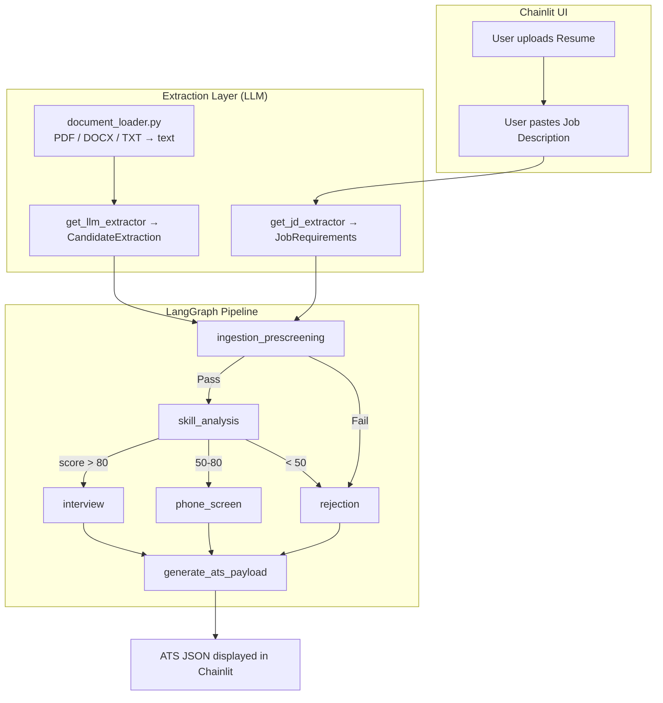

# Automated Talent Pipeline Agent

A **LangGraph**-powered AI agent that evaluates candidate resumes against a job description and produces ATS-ready JSON payloads. Includes a **Chainlit web UI** for interactive use.

---

## Architecture



---

## Project Structure

```
week 3/
├── .env                       ← Your API keys (not committed to git)
├── .env.example               ← Template
├── .gitignore
├── requirements.txt
├── README.md
│
├── app/
│   ├── __init__.py
│   ├── state.py               ← TalentPipelineState TypedDict
│   ├── llm.py                 ← LLM factory (Gemini / OpenAI / Fallback)
│   │                             CandidateExtraction + JobRequirements schemas
│   ├── document_loader.py     ← PDF / DOCX / TXT → plain text
│   ├── nodes.py               ← 6 LangGraph node functions
│   ├── routing.py             ← Deterministic conditional edge functions
│   ├── graph.py               ← StateGraph builder
│   ├── main.py                ← CLI runner (4 sample candidates)
│   └── chainlit_app.py        ← Chainlit web UI
│
├── data/
│   ├── job_description.json   ← Sample Backend Engineer JD (for CLI testing)
│   └── resumes/
│       ├── strong.txt         → Expected: Interview
│       ├── medium.txt         → Expected: Phone Screen
│       ├── weak.txt           → Expected: Rejected (low skill score)
│       └── knockout_fail.txt  → Expected: Rejected (pre-screening)
│
└── tests/
    ├── test_pipeline.py       ← Routing, node, and end-to-end tests
    └── test_document_loader.py← Document extraction + unstructured resume tests
```

---

## LangGraph Nodes

| Node | Description |
|---|---|
| `ingestion_prescreening` | Extracts candidate info via LLM; performs knockout requirement checks |
| `skill_analysis` | Compares extracted skills vs. required skills; computes score |
| `interview` | Sets `final_disposition = "Interview"` |
| `phone_screen` | Sets `final_disposition = "Phone Screen"` |
| `rejection` | Sets `final_disposition = "Rejected"` with reason |
| `generate_ats_payload` | Assembles the final ATS JSON |

---

## Conditional Edges (Deterministic Python — No LLM Involved)

| After Node | Condition | Next Node |
|---|---|---|
| `ingestion_prescreening` | `pre_screening_status == "Fail"` | `rejection` |
| `ingestion_prescreening` | `pre_screening_status == "Pass"` | `skill_analysis` |
| `skill_analysis` | `score > 80` | `interview` |
| `skill_analysis` | `50 ≤ score ≤ 80` | `phone_screen` |
| `skill_analysis` | `score < 50` | `rejection` |

---

## How the Chainlit UI Works

1. User opens `http://localhost:8000`
2. User clicks the **📎 attachment button** and uploads a resume (PDF / DOCX / TXT)
3. User pastes a **Job Description** as plain text into the chat
4. The agent:
   - Extracts job requirements from the JD via LLM (`JobRequirements` schema)
   - Extracts text from the uploaded file (`document_loader.py`)
   - Runs the LangGraph pipeline
5. Results are displayed in chat sections:
   - 👤 Candidate Information
   - 🔍 Pre-Screening (PASS / FAIL)
   - 📊 Skill Analysis (score, matched, missing, additional)
   - 🎯 Final Recommendation
   - 📋 ATS Payload (formatted JSON)
6. A downloadable `ats_payload_<name>.json` file is offered

---

## Supported File Formats

| Format | Library Used |
|---|---|
| `.pdf` | PyMuPDF (`fitz`) |
| `.docx` | python-docx |
| `.txt` | Built-in Python |

---

## How Unstructured Resumes Are Handled

The system does **not** require fixed resume sections.

Examples of what it handles:
- Traditional structured CVs (sections, bullet points)
- Story-like paragraphs ("During six years at TechCorp, I worked with Python...")
- Mixed formats (some sections + some paragraphs)
- Different ordering of sections

**How:** The LLM extractor receives the full raw text and is prompted to extract
information regardless of format. The prompt explicitly instructs it to look for
skills inside paragraphs and natural language, not just in bullet lists.

The regex fallback (used without an API key) handles structured resumes best
but also scans full text for known technology keywords.

---

## Environment Variables

Copy `.env.example` to `.env` and fill in your key:

```env
# Use Gemini (default)
LLM_PROVIDER=gemini
GOOGLE_API_KEY=your_google_api_key_here

# OR use OpenAI
# LLM_PROVIDER=openai
# OPENAI_API_KEY=your_openai_api_key_here
```

If no API key is set → the pipeline automatically uses the **regex fallback extractor**.

---

## Installation

```bash
cd "week 3"

# Create virtual environment
py -3 -m venv .venv
.venv\Scripts\activate       # Windows
# source .venv/bin/activate  # Mac/Linux

pip install -r requirements.txt
```

---

## How to Run — CLI

```bash
python -m app.main
# or
python -X utf8 -m app.main   # Windows (ensures UTF-8 console output)
```

Runs all 4 sample candidates and prints ATS payloads to the console.

---

## How to Run — Chainlit UI

```bash
chainlit run app/chainlit_app.py
```

Then open **http://localhost:8000** in your browser.

---

## How to Run Tests

```bash
pytest tests/ -v
```

Tests use the **fallback extractor** — no API key required.

---

## Example User Flow (Chainlit)

```
User:   [uploads strong_candidate.pdf]
Agent:  ✅ Resume loaded (1250 characters). Now paste the Job Description.

User:   We are looking for a Backend Engineer with 3+ years experience.
        Must have a Bachelor's degree. Required: Python, SQL, Docker, React, API Integration.

Agent:  🤖 Extracting job requirements...
        📋 Required skills: Python, SQL, Docker, React, API Integration
            Knockout: Bachelor | Min experience: 3 years

        🤖 Extracting candidate information...
        🔍 Running pre-screening...
        📊 Analyzing skills...
        🎯 Generating recommendation...
        ✅ Analysis complete!

        ## 👤 Candidate Information
        - Name: Jane Smith
        - Email: jane.smith@email.com
        ...

        ## 🔍 Pre-Screening
        ✅ PASS

        ## 📊 Skill Analysis
        Score: 100%
        Matched: Python, SQL, Docker, React, API Integration
        Missing: (none)

        ## 🎯 Final Recommendation
        🟢 INTERVIEW

        ## 📋 ATS Payload (JSON)
        { ... }

        💾 Download: ats_payload_Jane_Smith.json
```

---

## Expected Routing (Sample Candidates)

| Candidate | Pre-Screening | Skill Score | Disposition |
|---|---|---|---|
| Strong | Pass | 100% | **Interview** |
| Medium | Pass | 60% | **Phone Screen** |
| Weak | Pass | 0% | **Rejected** |
| Knockout Fail | **Fail** | N/A | **Rejected** |
